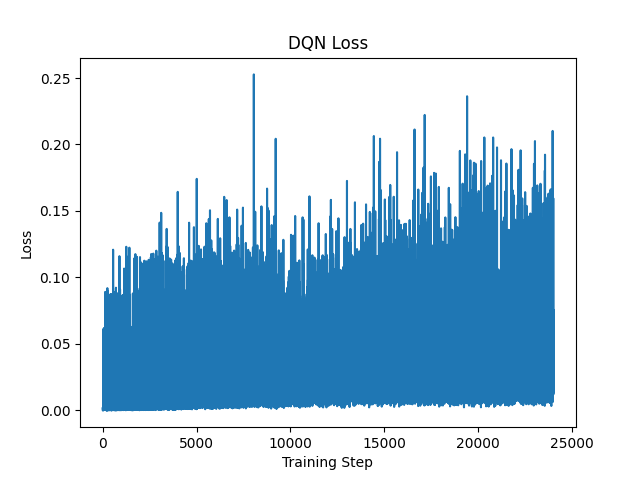
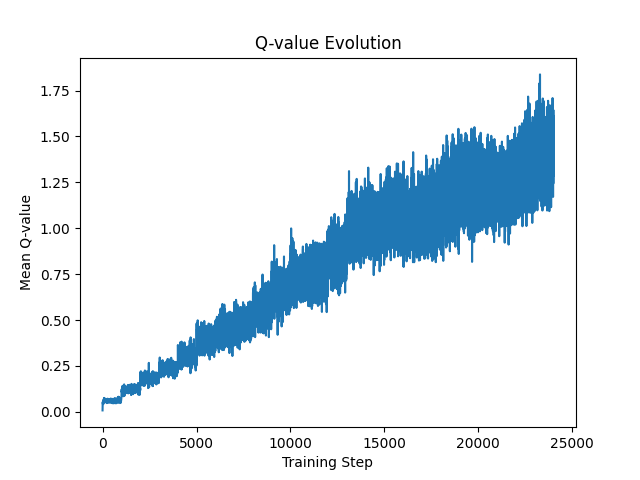
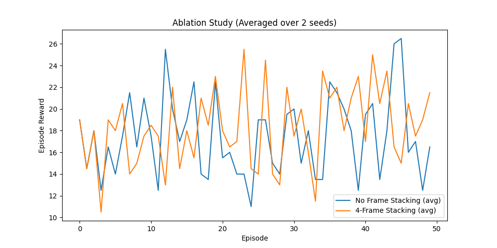
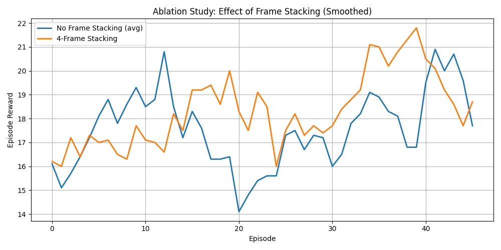

# Deep Q-Network for Atari Ms. Pac-Man


A Deep Q-Network (DQN) agent trained from raw pixel input to play Ms. Pac-Man using PyTorch, achieving consistent reward improvement and high-scoring trajectories under limited training.

---

## Key Highlights

* Learned directly from raw pixel input (no handcrafted features)
* Achieved ~54% improvement in average reward (**late vs early training**)
* Evaluation performance reaches **500–700 average score**
* Best episode exceeds **1400+ score**
* Includes ablation study on frame stacking (temporal information)

---

## Results Summary

**Training Performance**

* Early Training Avg Reward → low (random behavior)
* Late Training Avg Reward → significantly improved
* Relative Improvement → **~54% (late vs early training)**

**Evaluation (20 Episodes, Greedy Policy)**

* Average Score → **~500–700**
* Best Episode → **~1400+**

**Training Setup**

* Environment: ALE/MsPacman-v5
* Frame Stack: 4
* Input Resolution: 64×64

**Key Insight**

The agent transitions from random exploration to structured reward-seeking behavior, achieving high-reward trajectories (>1000 score). However, performance variance remains high due to limited training duration.

---

## Training Performance

### Reward Curve


* Clear upward trend showing learning progression
* High variance due to stochastic environment and limited training
* Later episodes show emergence of consistent reward patterns

---

### Loss Curve



* Loss stabilizes over time
* Indicates improving Q-value estimation and reduced training instability

---

### Q-Value Evolution



* Increasing Q-values reflect improved value estimation
* Stabilization suggests learning progression and policy refinement

---

## Ablation Study: Frame Stacking

To evaluate the importance of temporal information, an ablation study was conducted by removing frame stacking while keeping all other components fixed.

### Results

* No Frame Stacking → Mean = 17.45, Std = 3.70
* 4-Frame Stacking → Mean = 18.32, Std = 3.56
* Improvement → **+0.87**

---

### Raw Reward Comparison



---

### Smoothed Reward Comparison



---

### Analysis

* Frame stacking improves learning stability
* Provides temporal context for movement prediction
* Without stacking, the agent struggles to infer motion from static frames
* Improvement is modest due to limited training duration

---

## Method

The implementation follows the standard DQN framework:

* Convolutional Neural Network for Q-value approximation
* Experience Replay
* Target Network
* Epsilon-greedy exploration
* Reward clipping and gradient clipping

---

## State Representation

* RGB frames → grayscale
* Resized to 64 × 64
* 4-frame stack → captures temporal dynamics

---

## Training Details

* Episodes: up to 300
* Replay Buffer Size: 10,000
* Batch Size: 16
* Discount Factor (γ): 0.99
* Learning Frequency: every 4 steps
* Exploration: ε-decay from 1.0 → ~0.05

---

## Challenges & Fixes

**Challenges**

* Q-value divergence during training
* High variance in episodic rewards
* Slow convergence under compute constraints

**Fixes**

* Tuned epsilon decay schedule
* Adjusted target network update frequency
* Applied reward clipping and gradient clipping

---

## Gameplay

Full gameplay (best episode):

[](videos/pacman.mp4)

---

## Project Structure

```
DQN-Pacman/
├── notebooks/
├── models/
├── results/
│   ├── training/
│   └── ablation/
├── videos/
├── data/
```

---

## Technologies Used

* Python
* PyTorch
* Gymnasium (Atari environments)
* OpenCV
* NumPy
* Matplotlib

---

## Limitations

* Limited training due to compute constraints
* High variance in rewards
* Not fully converged

---

## Future Work

* Double DQN
* Dueling Networks
* Prioritized Experience Replay
* Longer training

---

## Author

Aastha Khatri
