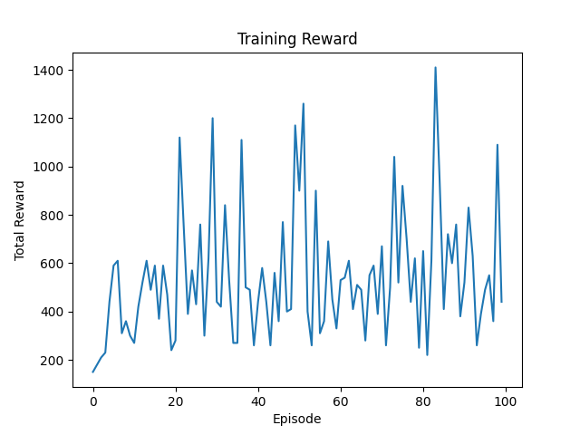
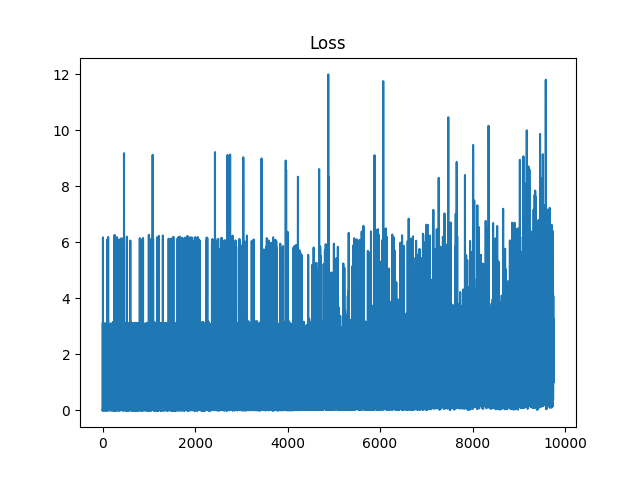

# Deep Q Network for Atari MsPacman

Tested on Google Colab.

This project implements a Deep Q Network (DQN) agent to play Atari MsPacman using PyTorch. The agent learns directly from raw pixel input and improves its performance through interaction with the environment.

## Overview

The objective is to train an agent that can navigate the MsPacman environment, collect rewards, and avoid negative outcomes. The model processes visual input using a convolutional neural network and learns action-value estimates through reinforcement learning.
This project focuses on understanding the practical challenges of training deep reinforcement learning agents from visual input.

## Approach

The implementation follows the standard DQN framework with the following components:

- A convolutional neural network to estimate Q-values from image input  
- Experience replay to reduce correlation between samples  
- A target network to stabilize learning  
- Frame stacking to incorporate temporal information  
- An epsilon-greedy policy for exploration  

The input to the model consists of four consecutive grayscale frames (84×84), allowing the agent to capture motion and environment dynamics.

## Training

The agent was trained with a constrained replay buffer and reduced episode length to allow faster experimentation. While the training setup is lightweight, it captures the essential behavior of a DQN agent and produces meaningful results.

## Results

The agent achieves non-trivial rewards and shows clear learning progress over time.  
Although performance remains noisy due to ongoing exploration, later episodes demonstrate improved reward compared to earlier stages.

### Reward Curve


### Loss Curve


## Ablation Study

To better understand the importance of temporal information, an ablation study was conducted comparing:

- Single-frame input (no temporal context)  
- 4-frame stacked input (with temporal context)  

The results show that the agent trained with frame stacking performs significantly better.

Without temporal context, the agent struggles to:
- anticipate ghost movement  
- maintain consistent direction 
- learn stable behaviour 

This highlights the importance of temporal information in partially observable environments like MsPacman.

Detailed experiments can be found in:
`notebooks/dqn_pacman_ablation.ipynb`

## Gameplay

A sample gameplay recording generated after training is available at:

`videos/pacman.mp4`

## Project Structure
```
DQN-Pacman/
├── notebooks/ # Training and ablation notebooks
├── models/ # Saved model weights
├── videos/ # Gameplay recordings
├── images/ # Training plots
├── data/ # Stored metrics
└── README.md
```

## Technologies Used

- Python  
- PyTorch  
- Gymnasium (Atari environments)  
- OpenCV  
- NumPy  
- Matplotlib  

## Notes

This project focuses on understanding and implementing the core ideas behind Deep Q Learning rather than achieving optimal performance. Training time and resources were intentionally limited, but the implementation includes all key components of the DQN algorithm.

## Possible Improvements

- Double DQN to reduce overestimation  
- Dueling network architecture  
- Prioritized experience replay  
- Longer training for improved performance  

## Author

Aastha Khatri
